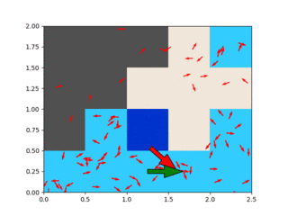

# cbl_particle_filter

A particle filter implementing carpet-based localisation.

Inputs to particle filter are:
* odometry: pose delta since previous update
* color: current detected carpet color under robot
* map: grid map of carpet colors

Output of particle filter is the current pose (2D) of the robot



Figure: playback of particle filter using simulated input data (see [simulator.py](./cbl_particle_filter/simulator.py)), driving in a loop on a small map. Legend:
* green arrow: ground truth pose
* large red arrow: estimated pose from particle filter
* small red arrows: particle filter particles
* blue/grey/beige background: carpet color pattern map

For ROS wrapper around this package, see [carpet_localisation_ros](https://github.com/tim-fan/carpet_localisation_ros).

## Dev setup:

```
git clone git@github.com:tim-fan/carpet_localisation.git
python3 -m venv venv
source venv/bin/activate
pip install -r requirements-dev.txt
pip install -e .
```

## Run tests
```bash
pytest .
```
Or to view output of plotting tests:
```bash
pytest . --show_plot True
```

## Dev log

* tried state output as mean of 50% oldest particles. Playback errors in notebook were slightly degraded - will not investigate further.

## Ideas

* for determining current pose from particle cloud - generate a big dataset of particles + ground truth pose combinations. Use this to quickly evaluate options.
  * Would this be a function which can be learned from enough data? Could an algorithm learn to distinguish between particle clusters, and pick the best one?